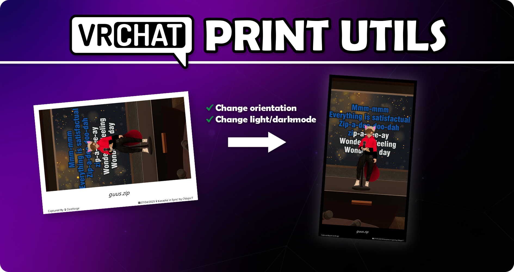

<p align="center">
  
</p>

# VRC Print Utils

Small, vibe-coded script I use to light/darkmode and change orientation on VRChat prints.  
I decided to upload it in case it helps anyone else doing the same things.

- Rotate the inner **photo** (clockwise/counter-clockwise) and rebuild the print box
- Switch between **light/dark frame**
- Works with the original **landscape** or the **portrait** this tool makes
- Non-destructive filenames with suffixes (`-orientation`, `-darkmode` / `-lightmode`)
- Bicubic scaling everywhere it resizes *(it never resizes the photo itself; only the box parts)*

---

## What’s in here

- `VRCprintutils/vrcprintutils.py` — interactive CLI tool (Windows/Linux/macOS)
- `VRCprintutils/SelectPrintBox-horizontal.atn` — Photoshop Action: selects the photo area for **landscape** prints  
- `VRCprintutils/SelectPrintBox-vertical.atn` — Photoshop Action: selects the photo area for **portrait** prints

The Photoshop Actions are just helpers I use to isolate the picture, so you can easily color grade it without touching the white/black frame.

---

## Install

You’ll need Python 3.9+ and a terminal.

```bash
pip install pillow InquirerPy colorama
